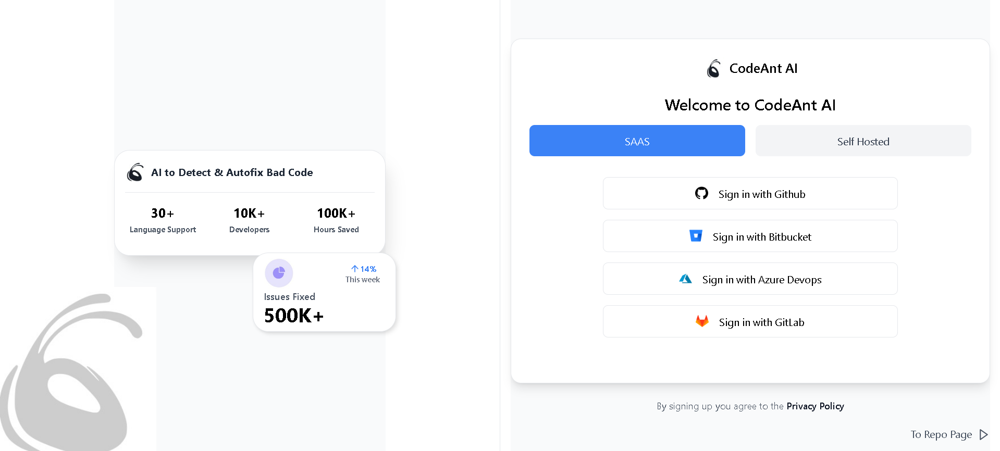
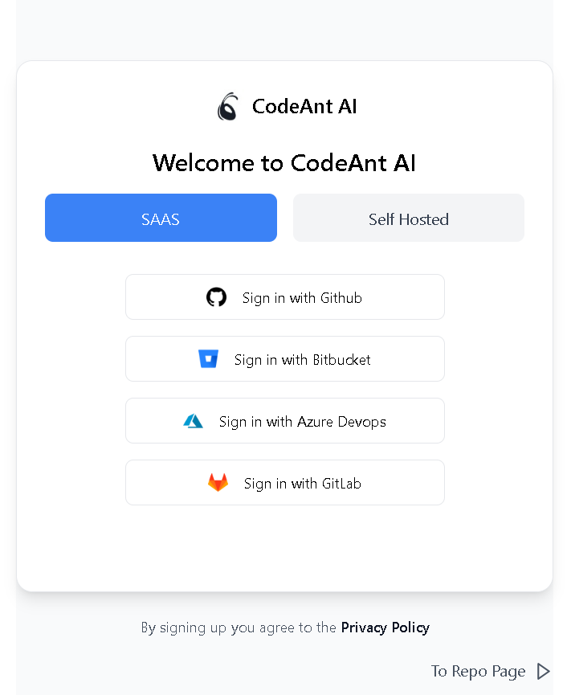
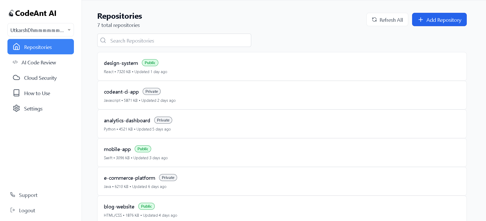
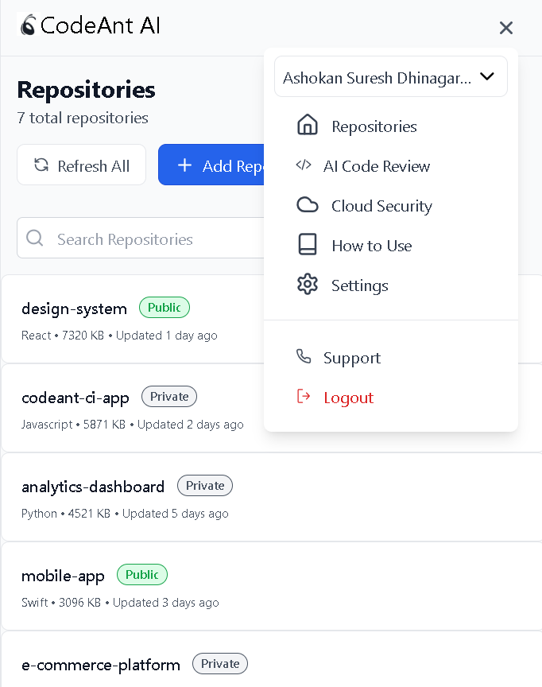

# Introduction

The live link for the demo of the project change be accessed here: 

This website is part of the submission to the CodeAnt AI assignment for the position of a Frontend Developer Intern.

I have made use of the following technologies:
- React
- React-router-dom
- React-icons
- Favicon
- Javascript
- Tailwind CSS

## Demo ScreenShots and vidoes

The demo video can be found the ./misc folder. File name - Demo Video.mp4

- 
- 
- 
- 

## Project Structure

- `src/`
  - `components/`
    - `Hamburger.jsx`
    - `MetricsCard.jsx`
    - `SignInCard.jsx`
  - `pages/`
    - `RepositoriesPage.jsx`

  - `App.js`

App.js is the source point of the project. It is the component that renders the login page according to the Figma Design.

It makes use of the following components:
- `SignInCard`
- `MetricsCard`

At the bottom right hand corner of the source login page is a `To Repo Page` button that redirects the user to the Repositories Page.

The repositories page is a page that renders the repositories of the user. It makes use of the following components:
- `Hamburger`

## Available Scripts

In the project directory, you can run:

### `npm start`

Runs the app in the development mode.\
Open [http://localhost:3000](http://localhost:3000) to view it in your browser.

The page will reload when you make changes.\
You may also see any lint errors in the console.

